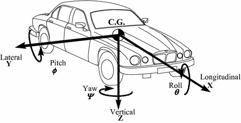
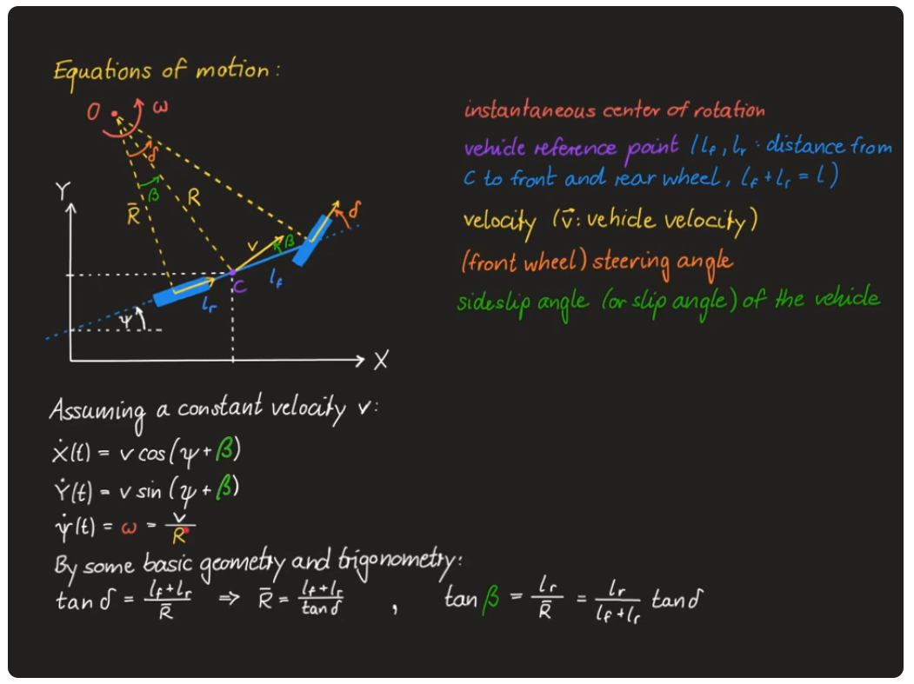

## Coordinate systems and units

The model uses the SAE conform coordinate systems. The vehicle fixed coordinate system: 
- x is in the longitudinal direction, with positive going forward
- y is the lateral direction, with positive going to the right (when looking forward)
- z is the vertical direction, with positive going downward
- heading angle (yaw angle) is positive in counter clockwise direction

In the world-fixed coordinate system axis z also points downward.

As the model is strictly in 2D, pitch and roll angle are not used.

All units are in SI (including angles which are in radian)

The naming convention is as following:
- x and y the position in x and y direction
- x_dot and y_dot are the velocities in x-y directions
- speed is a scalar (it is the length of the velicoty vector)
- steering angle is the angle of the wheels compared to the vehicle axis. Positive is counterclockwise.

## Kinematic Bicycle Model

The classic kinematic bicylce model is described all over the literature. This project is implemented corresponding to the explanation on the [channel of Prof. Georg Schildbach.](https://www.youtube.com/watch?v=HqNdBiej23I) 

The equations implemented:

